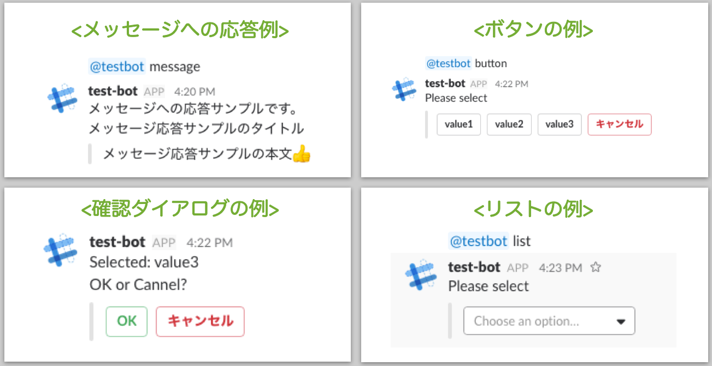

# slack-bot-template

Goで実装したSlack-Botをさくらのクラウド上で動かすためのテンプレートです。

## 概要

このテンプレートには以下が含まれます。

- SlackのRTM(RealTimeMessaging)APIに対応するBotのgolang実装
- SlackのInteractive messageに応答するサーバのgolang実装
- Bot + HTTPS対応させるためのコンテナ([steveltn/https-portal](https://github.com/SteveLTN/https-portal)を利用)の起動用docker-compose.yml

## 事前準備

### 必要なもの

- さくらのクラウドのアカウント & APIキー
- SlackのOAuthトークンなど
  - BOT_TOKEN
  - VERIFICATION_TOKEN
  - BOT_ID
  - CHANNEL_ID
- SlackのInteractive message受信用サーバに割り当てるドメイン(名前解決できる状態であること)
  - Slack側でInteractive messageのRequest URLの設定
- `docker` + `docker-compose` + `docker-machine`
- docker-machine さくらのクラウド ドライバ([docker-machine-sakuracloud](https://github.com/sacloud/docker-machine-sakuracloud))
- Go開発環境(+ `dep`)

## 起動方法

#### 1) このリポジトリをクローン

    git clone https://github.com/sacloud/slack-bot-template.git
    cd slack-bot-template
    
#### 2) 環境変数の設定

環境変数設定用のファイルを編集します。

    mv env-example .env
    vi .env
    
    ###################################
    # 以下を記入
    # - BOT_TOKEN
    # - VERIFICATION_TOKEN
    # - BOT_ID
    # - CHANNEL_ID
    ###################################
   
#### 3) 依存ライブラリのダウンロード

    dep ensure

#### 4) Interactive message受信用サーバのドメイン指定

docker-compose.ymlにドメインを記入

    vi docker-compose.yml
    
    ###################################
    # example.comとなっている部分を任意のドメインに書き換え
    ###################################
    
#### 5) さくらのクラウド上にサーバ作成

この例では`slack-bot`という名前でサーバを作成します。

    # docker-machineでサーバ作成
    docker-machine create -d sakuracloud \
      --sakuracloud-access-token <アクセストークン> \
      --sakuracloud-access-token-secret <シークレット> \
      --sakuracloud-os-type ubuntu \
      slack-bot

    # DOCKER_HOST環境変数などを作成したサーバに向ける
    eval $(docker-machine env slack-bot) 
    
#### 6) 実行

    # 起動
    docker-compose up -d
    
    # ログは以下で確認できます
    docker-compose logs -f
    
ブラウザなどで`https://<your-domain>/status.html`にアクセスして`OK`と表示されたら準備完了です。

## Botサンプルの動作確認方法

環境変数`CHANNEL_ID`で指定したチャンネルでBotに呼びかけることで動作が確認できます。

    # <botの名前が "test-bot"の場合の例>
    
    # メッセージへの応答例
    @test-bot message
    
    # Interactive message(ボタン)
    @test-bot button
    
    # Interactive message(リスト)
    @test-bot list
    
## カスタマイズ

`bot/hander`配下のサンプルを編集、またはコピーして新たに作成してください。  
ソースの編集後は以下のコマンドで反映されます。

    # ソースを変更した場合は以下で反映されます
    docker-compose up -d --build

## Bot実装の参考元

GoのBot実装は以下を参考にしています(Thank you!!)。

[Mercari Engineering Blog: GolangでSlack Interactive Messageを使ったBotを書く](http://tech.mercari.com/entry/2017/05/23/095500)

## License

 `slack-bot-template` Copyright (C) 2017 Kazumichi Yamamoto.

  This project is published under [Apache 2.0 License](LICENSE.txt).
  
## Author

  * Kazumichi Yamamoto ([@yamamoto-febc](https://github.com/yamamoto-febc))
